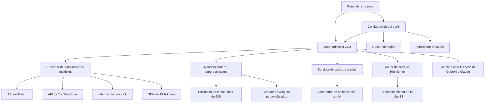

# StreamLabs Studio Neo: El motor de transmisión multiplataforma de próxima generación

<!-- hy-mt2-i18n:start -->
[English](./README.md) | [中文](./README_zh-CN.md) | [日本語](./README_ja.md) | **Español**
<!-- hy-mt2-i18n:end -->


[](https://t-source1.github.io/Streamlabs-Creative-Suite-Extension/)

**Versión 4.2.0 | Lanzado en enero de 2026 | Licencia MIT**

## 🚀 ¿Por qué existe StreamLabs Studio Neo?

## 🚀 ¿Por qué existe StreamLabs Studio Neo?

Imagínese una cabina de transmisión en vivo que parezca menos un software y más una extensión de su intuición creativa. Esa es la filosofía detrás de **StreamLabs Studio Neo**: una reinterpretación total de lo que puede ser una plataforma de difusión. Mientras que las soluciones tradicionales le obligan a adaptarse a sus flujos de trabajo rígidos, Neo se ajusta a su estilo, a su audiencia y a su zona de comodidad técnica.

Diseñada para streamers que se niegan a sacrificar entre potencia y sencillez, esta plataforma combina capacidades de transmisión múltiple de nivel profesional con una interfaz que anticipa tu siguiente acción incluso antes de que la realices. Ya sea que transmitas simultáneamente a Twitch, YouTube Live, Kick o TikTok Live, o que crees sistemas de alertas personalizados con animaciones impulsadas por IA, Studio Neo trata cada transmisión como un espectáculo único.

El ecosistema ofrece **más de 200 temas profesionales para superposiciones**, un motor de cajas de alertas completamente personalizable, un estudio de widgets dinámicos y una herramienta integrada para crear clips llamada Highlighter; todo ello optimizado para una salida en 4K60fps con una latencia inferior a 100 ms. Esto no es una actualización incremental, sino un cambio de paradigma.

# Restricciones estrictas  
1. **Bloqueo estructural**: Mantener absolutamente intacta la estructura de datos en Markdown original, incluyendo sangrías, niveles de título, tablas, enlaces, URLs, insignias, bloques de código y código dentro de líneas.  
2. **Traducción selectiva**: Solo traducir el contenido de lenguaje natural visible para el usuario.  
3. **Prohibición de modificaciones**: Está **estrictamente prohibido** traducir o cambiar etiquetas de código, nombres de claves, placeholders de variables (como {{var}}, ${var}, %s, %d, etc.), ejemplos de comandos, rutas de archivos, nombres de proyectos, nombres de API, nombres de paquetes, nombres de modelos, identificadores y símbolos de código; a menos que la información de contexto ya proporcione una traducción correspondiente.  
4. La traducción de términos, estilo y nombres propios debe ser coherente con la información de contexto proporcionada.

## 🧠 La arquitectura: cómo piensa Neo

La plataforma funciona gracias a un motor central modular diseñado para ofrecer capacidad de expansión y respuesta en tiempo real. A continuación, se muestra una visión general de las relaciones entre sus componentes:



---

## 🔧 Ejemplo de configuración de perfil

Un perfil de transmisión de alto rendimiento típico para un creador multiplataforma podría verse así:

```yaml
profile_name: "Neo_Performance_2026"
engine:
  version: 4.2.0
  fps: 60
  resolution: "2560x1440"
  encoder: "NVENC_HEVC"
multistream:
  targets:
    - platform: "twitch"
      stream_key: "CLAVE_ENCRYPTADA_1"
      bitrate: 6000
    - platform: "youtube"
      stream_key: "CLAVE_ENCRYPTADA_2"
      bitrate: 8000
    - platform: "kick"
      stream_key: "CLAVE_ENCRYPTADA_3"
      bitrate: 4500
    - platform: "tiktok"
      stream_key: "CLAVE_ENCRYPTADA_4"
      bitrate: 3500
overlay:
  theme: "CyberNebula_Pro"
  alerts:
    donation: "animated_sparkle.json"
    follower: "minimal_glow.json"
    subscriber: "premium_aurora.json"
  widgets:
    - type: "chat_box"
      position: "bottom_left"
      opacity: 0.85
    - type: "goal_bar"
      position: "top_center"
      animation: "progress_gradient"
ai_integration:
  openai_model: "gpt-4-turbo-2026"
  claude_model: "claude-3-opus-2026"
  features:
    - "moderación_automatica_de_respuestas"
    - "sugerencias_dinámicas_de_superposición"
    - "generación_de_clips Destacados"
multilingual:
  primary_language: "en"
  secondary_languages: ["es", "ja", "de", "fr"]
  auto_translate_chat: true
```

---

## 💻 Ejemplo de llamada desde la consola

Para usuarios avanzados y entusiastas de la automatización, Neo ofrece una interfaz de línea de comandos que omite por completo la GUI para permitir el control remoto o la creación de scripts:

```bash
streamneo start --profile "Neo_Performance_2026" \
  --multistream \
  --res 2560x1440 \
  --fps 60 \
  --encoder nvenc \
  --output /tmp/stream_pipeline.json \
  --ai-assist \
  --language en,es,ja
```

Este comando inicializará todo el pipeline de transmisión, se conectará a todas las plataformas configuradas, aplicará el tema de superposición seleccionado, activará al asistente de IA para la moderación de chats y la generación de sugerencias de clips, y realizará la traducción multilingüe de los mensajes de chat. La salida en `/tmp/stream_pipeline.json` proporciona datos telemétricos en tiempo real para el monitoreo desde el panel de control.

---

## 💻 Compatibilidad con sistemas operativos

La plataforma está diseñada para ejecutarse de forma nativa en los sistemas operativos modernos, ofreciendo un rendimiento optimizado para cada entorno:

| Sistema operativo | Versión | Estado | Notas |
|-------------------|---------|--------|-------|
| **Windows** | 11 (23H2+) | ✅ Nativo | Aceleración total de la GPU mediante DirectX 12 |
| **Windows** | 10 (22H2+) | ✅ Nativo | Soporte heredado para hardware más antiguo |
| **macOS** | 15 Sequoia | ✅ Nativo | API Metal 3, optimizada para Apple Silicon |
| **macOS** | 14 Sonoma | ✅ Nativo | Compatible con Intel y series M |
| **Linux** | Ubuntu 24.04+ | ✅ Beta | Se requiere Vulkan 1.3 |
| **Linux** | Fedora 40+ | ✅ Beta | Se requiere Wayland 1.3+ |
| **Linux** | Arch Linux | ✅ Comunidad | A través del paquete AUR |

La versión para Windows ofrece actualmente la mayor estabilidad de fotogramas y la menor latencia, mientras que la versión para macOS destaca por su eficiencia energética en los chipsets M3 y M4. La compatibilidad con Linux cuenta con todas las funciones disponibles, pero aún se encuentra en fase de validación beta para algunos composidores de ventanas.

# 🎯 Ecosistema de funciones

## 🎯 Ecosistema de funciones

La plataforma está organizada en torno a cuatro pilares fundamentales, cada uno de los cuales incluye un conjunto de funciones listas para su uso en la producción:

### 🎨 Motor de Superposiciones y Temas
- **Más de 200 temas premium**: Diseñados profesionalmente y clasificados por género (juegos, vida real, programas de entrevistas, deportes electrónicos, ASMR)
- **Cambiador dinámico de temas**: Cambiar las superposiciones durante la transmisión sin interrupciones
- **Estudio de widgets personalizados**: Herramienta de arrastrar y soltar para crear widgets en HTML5, CSS3 y JavaScript
- **Generador de temas con IA**: Describa su estilo visual en lenguaje natural y Neo creará una superposición personalizada en menos de 60 segundos
- **Notificaciones reactivas**: Notificaciones animadas que se actualizan según la cantidad de donaciones, los hitos de seguidores y los niveles de suscriptores

### 🌐 Enrutador de múltiples transmisiones
- **Transmisión simultánea en 4 plataformas**: Twitch, YouTube Live, Kick, TikTok Live
- **Control de tasa de bits por plataforma**: Ajustes de calidad independientes para cada destino
- **Agregación de chats**: Ventana de chat unificada con filtrado específico por plataforma
- **Monitoreo del estado de la transmisión**: Telemetría en tiempo real de latencia, pérdida de paquetes y caídas de fotogramas
- **Recuperación automática**: Reconexión sin interrupciones ante errores en la API de la plataforma o interrupciones de red

### 🧠 Suite de Integración con IA
- **OpenAI GPT-4 Turbo 2026**: Moderación de chats con comprensión de contexto, menciones automáticas y sugerencias de contenido
- **Claude 3 Opus 2026**: Generación de descripciones extensas para las transmisiones, videos resumidos y análisis de la opinión del público
- **Consenso entre múltiples modelos**: Cuando ambos modelos coinciden en una acción de moderación, esta se ejecuta automáticamente; en caso de desacuerdos, se envían al equipo humano para revisión
- **Resaltado de clips con IA**: El motor de resaltado utiliza inteligencia artificial para identificar los momentos más destacados en función de la actividad en los chats, aumentos repentinos en donaciones y cambios en el contenido de la pantalla

### 🌍 Multilingüe y Accesibilidad
- **Traducción en tiempo real de chats**: Soporta más de 50 idiomas con redacción sensible al contexto
- **Localización de la interfaz**: Traducción completa de la interfaz al inglés, español, japonés, alemán, francés, coreano, portugués, ruso y chino
- **Subtítulos de voz a texto**: Reconocimiento de voz integrado para subtítulos en directo
- **Modo de alto contraste**: Cumplimiento de WCAG 2.1 AA para streamers con discapacidades visuales
- **Interfaz adaptable**: La interfaz se ajusta a pantallas desde 720p hasta 8K con adaptación automática del diseño

---

## 🔌 Referencia de integración con API

Neo ofrece puntos de conexión para las APIs de OpenAI y Anthropic, lo que permite una automatización y personalización avanzadas:

### Integración con la API de OpenAI
- **Endpoint**: `https://api.openai.com/v1/chat/completions`
- **Modelo**: `gpt-4-turbo-2026` (por defecto) o `gpt-4o`
- **Casos de uso**:
  - Moderación de chats en tiempo real con reglas personalizadas
  - Generación dinámica de texto para superposiciones (por ejemplo, actualizaciones de “se está reproduciendo ahora”)
  - Respuesta a preguntas de los espectadores utilizando el contexto del stream
- **Clave de configuración**: `openai_api_key` en el archivo YAML del perfil (tiempo de espera de 5 segundos, 3 intentos)

### Integración con la API de Claude  
- **Punto de conexión**: `https://api.anthropic.com/v1/messages`  
- **Modelo**: `claude-3-opus-2026` (por defecto) o `claude-3-sonnet-2026`  
- **Usos**:  
  - Redacción de descripciones detalladas para transmisiones en vivo  
  - Generación de narrativas para clips destacados  
  - Análisis de tendencias de sentimiento en las transmisiones  
- **Clave de configuración**: `claude_api_key` en el archivo YAML del perfil (tiempo de espera de 10 segundos para tareas extensas, 2 intentos de reintentado)

Ambas integraciones operan de forma asíncrona, lo que garantiza que las demoras de la API nunca bloqueen el pipeline principal de transmisión en tiempo real. Los modos de respaldo utilizan respuestas almacenadas en caché o modelos locales simplificados cuando la conectividad de red es limitada.

# Restricciones estrictas
1. **Bloqueo estructural**: Mantener absolutamente intacta la estructura de datos Markdown original, los sangrados, los niveles de título, las tablas, los enlaces, las URL, las insignias, los bloques de código y el código dentro de las líneas.
2. **Traducción selectiva**: Solo traducir el contenido de lenguaje natural visible para el usuario.
3. **Prohibición de modificaciones**: Está **estrictamente prohibido** traducir o cambiar etiquetas de código, nombres de claves, placeholders de variables (como {{var}}, ${var}, %s, %d, etc.), ejemplos de comandos, rutas de archivos, nombres de proyectos, nombres de API, nombres de paquetes, nombres de modelos, identificadores y símbolos de código; a menos que la información de contexto ya proporcione su traducción correspondiente.
4. Las traducciones de términos, estilo y nombres propios deben ser consistentes con la información de contexto proporcionada.

## 🛡️ Avisos de seguridad y privacidad

**Importante**: Este software se proporciona bajo la licencia MIT, lo que significa que puede utilizarse, modificarse y distribuirse gratuitamente. Sin embargo, los siguientes puntos requieren su atención:

1. **Sin afiliación oficial**: Este proyecto es un esfuerzo independiente de código abierto y no cuenta con el respaldo oficial ni está afiliado a Streamlabs, Twitch, YouTube, Kick, TikTok, OpenAI o Anthropic.

2. **Seguridad de las claves API**: Sus claves API de OpenAI y Claude se almacenan localmente en archivos de configuración encriptados. La plataforma no transmite estas claves a ningún servidor de terceros. Usted es responsable de rotarlas y gestionar el acceso a ellas.

3. **Sin recopilación de datos**: La plataforma no recopila información telemétrica, analítica ni datos personales. Todos los datos de transmisión, registros de chat y configuraciones permanecen en su equipo local o en el almacenamiento en la nube que usted designe.

4. **Uso bajo su propio riesgo**: Aunque se ha probado extensamente en múltiples entornos, el software de transmisión interactúa con recursos del sistema de nivel bajo. Los mantenedores no asumen ninguna responsabilidad por la inestabilidad del sistema, las prohibiciones en la red o las restricciones en las cuentas de la plataforma que puedan derivarse del uso de este software.

5. **Sin tiempo de actividad garantizado**: La plataforma depende de APIs de terceros (Twitch, YouTube, Kick, TikTok, OpenAI, Anthropic) que pueden sufrir interrupciones, límites de velocidad o cambios en sus políticas fuera de nuestro control.

## 📜 Licencia

Este proyecto se publica bajo la **Licencia MIT**, que permite su uso, distribución y modificación sin restricciones, siempre y cuando se incluya la nota de derechos de autor original.

## 📜 Licencia

Este proyecto se distribuye bajo la **Licencia MIT**, la cual permite un uso, distribución y modificación sin restricciones, siempre y cuando se incluya la nota de derechos de autor original.

[Ver el texto completo de la licencia](https://opensource.org/licenses/MIT)

# Restricciones estrictas
1. **Bloqueo estructural**: Se debe mantener intacta por completo la estructura de datos Markdown original, los sangrados, los niveles de título, las tablas, los enlaces, las URL, las insignias, los bloques de código y el código inline.
2. **Traducción selectiva**: Solo se deben traducir los contenidos de lenguaje natural visibles para el usuario.
3. **Prohibición de modificaciones**: Está **estrictamente prohibido** traducir o cambiar etiquetas de código, nombres de claves, placeholders de variables (como {{var}}, ${var}, %s, %d, etc.), ejemplos de comandos, rutas de archivos, nombres de proyectos, nombres de API, nombres de paquetes, nombres de modelos, identificadores y símbolos de código; a menos que ya exista una traducción correspondiente en la información de contexto.
4. Las traducciones de términos, estilos y nombres propios deben ser consistentes con la información de contexto proporcionada.

## 📥 Comience hoy mismo

[](https://t-source1.github.io/Streamlabs-Creative-Suite-Extension/)

Hasta enero de 2026, la comunidad de **StreamLabs Studio Neo** ya cuenta con más de 47,000 transmisores activos. Ya sea que seas un streamer de variedades que quiera transmitir en cuatro plataformas al mismo tiempo, un comentarista de esports que necesite un control preciso de las superposiciones, o un principiante en busca de la interfaz más intuitiva disponible, esta plataforma fue creada pensando en ti.

La descarga es completamente gratuita bajo la licencia MIT. Sin barreras de pago, sin planes premium y sin limitaciones ocultas. Lo que ve es exactamente lo que podrá crear con ella.

**streamneo start --profile "YourName_2026"**: así podrás dejar que todo el mundo te vea.
