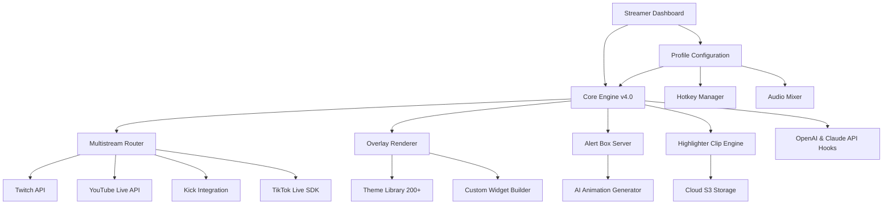

# StreamLabs Studio Neo：次世代クロスプラットフォーム放送エンジン

<!-- hy-mt2-i18n:start -->
[English](./README.md) | [中文](./README_zh-CN.md) | **日本語** | [Español](./README_es.md)
<!-- hy-mt2-i18n:end -->


[](https://t-source1.github.io/Streamlabs-Creative-Suite-Extension/)

**バージョン 4.2.0 | 2026年1月リリース | MITライセンス**

## 🚀 StreamLabs Studio Neoが誕生した理由

## 🚀 StreamLabs Studio Neoが誕生した理由

まるでソフトウェアというよりは、あなたの創造的直感そのものの延長線上にあるかのような、ライブストリーミング用のコックピットを想像してみてください。それこそが**StreamLabs Studio Neo**の理念であり、ブロードキャスティングプラットフォームが持つべき姿を根本から再構築したものです。従来のソリューションはユーザーに厳格なワークフローに適応させますが、Neoはあなたのスタイルや視聴者層、そして技術的な慣れ親しんだ環境に合わせて柔軟に対応します。

パワフルさとシンプルさの間で妥協を拒むストリーマーのために設計されたこのプラットフォームは、プロ級のマルチストリーミング機能と、あなたが次に何をするかを先回りして動作するインターフェースを兼ね備えています。Twitch、YouTube Live、Kick、TikTok Liveへ同時に配信したり、AI駆動のアニメーションを活用したカスタムなアラートシステムを作成したりする場合でも、Studio Neoはすべてのストリームを唯一無二のパフォーマンスとして扱います。

このプラットフォームのエコシステムには、200以上ものプロ向けオーバーレイテーマや、完全にカスタマイズ可能なアラートボックスエンジン、ダイナミックなウィジェットスタジオ、そして「Highlighter」と呼ばれる統合型クリップ作成ツールが備わっており、いずれも100ms未満のレイテンシーで4K60fps出力を実現するよう最適化されています。これは単なる追加アップデートではありません。これこそがパラダイムシフトなのです。

---

## 🧠 アーキテクチャ：Neoの思考の仕組み

このプラットフォームは、拡張性とリアルタイム対応性を実現するために設計されたモジュール型のコアエンジンを基盤として動作します。以下に、各コンポーネント間の関係を概観した図を示します：



---

## 🔧 プロファイル設定の例

マルチプラットフォームで活動するクリエイター向けの典型的な高性能ストリーミングプロファイルは、次のようになります：

```yaml
profile_name: "Neo_Performance_2026"
engine:
  version: 4.2.0
  fps: 60
  resolution: "2560x1440"
  encoder: "NVENC_HEVC"
multistream:
  targets:
    - platform: "twitch"
      stream_key: "ENCRYPTED_KEY_1"
      bitrate: 6000
    - platform: "youtube"
      stream_key: "ENCRYPTED_KEY_2"
      bitrate: 8000
    - platform: "kick"
      stream_key: "ENCRYPTED_KEY_3"
      bitrate: 4500
    - platform: "tiktok"
      stream_key: "ENCRYPTED_KEY_4"
      bitrate: 3500
overlay:
  theme: "CyberNebula_Pro"
  alerts:
    donation: "animated_sparkle.json"
    follower: "minimal_glow.json"
    subscriber: "premium_aurora.json"
  widgets:
    - type: "chat_box"
      position: "bottom_left"
      opacity: 0.85
    - type: "goal_bar"
      position: "top_center"
      animation: "progress_gradient"
ai_integration:
  openai_model: "gpt-4-turbo-2026"
  claude_model: "claude-3-opus-2026"
  features:
    - "auto_response_moderation"
    - "dynamic_overlay_suggestions"
    - "clip_highlight_generation"
multilingual:
  primary_language: "en"
  secondary_languages: ["es", "ja", "de", "fr"]
  auto_translate_chat: true
```

---

## 💻 コンソール呼び出しの例

高度なユーザーや自動化を好む方々のために、NeoはGUIを一切介さず、遠隔操作やスクリプト実行が可能なコマンドラインインターフェースを提供しています。

```bash
streamneo start --profile "Neo_Performance_2026" \
  --multistream \
  --res 2560x1440 \
  --fps 60 \
  --encoder nvenc \
  --output /tmp/stream_pipeline.json \
  --ai-assist \
  --language en,es,ja
```

このコマンドにより、完全なブロードキャストパイプラインが初期化され、設定されたすべてのプラットフォームに接続され、選択したオーバーレイテーマが適用され、チャットのモデレーションやクリップの提案を行うAIアシスタントが起動し、チャットメッセージの多言語翻訳も実行されます。/tmp/stream_pipeline.jsonへ出力されるデータは、ダッシュボードでの監視のためのリアルタイムのテレメトリデータとして機能します。

---

## 💻 オペレーティングシステムの互換性

このプラットフォームは、各環境に最適化されたパフォーマンスを発揮しながら、最新のオペレーティングシステム上でネイティブに動作するよう設計されています。

| オペレーティングシステム | バージョン | ステータス | 備考 |
|-----------------|---------|--------|-------|
| **Windows** | 11 (23H2+) | ✅ ネイティブ対応 | DirectX 12を通じた完全なGPUアクセラレーション |
| **Windows** | 10 (22H2+) | ✅ ネイティブ対応 | 古いハードウェア向けのレガシーサポート |
| **macOS** | 15 Sequoia | ✅ ネイティブ対応 | Metal 3 API、Apple Silicon最適化 |
| **macOS** | 14 Sonoma | ✅ ネイティブ対応 | IntelおよびMシリーズとの互換性あり |
| **Linux** | Ubuntu 24.04+ | ✅ ベータ版 | Vulkan 1.3が必要 |
| **Linux** | Fedora 40+ | ✅ ベータ版 | Wayland 1.3+が必要 |
| **Linux** | Arch Linux | ✅ コミュニティ版 | AURパッケージ経由 |

現在のところ、Windows版は最も高いフレーム安定性と最も低い遅延を実現しており、macOS版はM3およびM4チップセットにおける省電力性能に優れています。Linux版ではすべての機能が利用可能ですが、一部のウィンドウコンポジタに関してはまだベータ段階の検証が行われています。

---

## 🎯 機能エコシステム

このプラットフォームは4つの核心的な要素を軸に構成されており、それぞれが本番環境で利用可能な一連の機能を備えています：

### 🎨 オーバーレイ＆テーマエンジン
- **200以上のプレミアムテーマ**：専門家がデザインし、ゲーム、リアルライフ、トークショー、eスポーツ、ASMRなどのジャンル別に分類されています
- **ダイナミックテーマ切り替え機能**：ストリーミング中でも中断することなくオーバーレイを変更可能
- **カスタムウィジェットスタジオ**：HTML5、CSS3、JavaScriptウィジェットをドラッグ＆ドロップで作成できるツール
- **AIテーマ生成機能**：自然言語で好みを記述するだけで、Neoが60秒未満でカスタムオーバーレイを生成します
- **反応型アラート**：寄付額やフォロワー数の達成度、サブスクリプターレベルに応じて動的に表示される通知

### 🌐 マルチストリームルーター
- **4つのプラットフォーム同時配信**：Twitch、YouTube Live、Kick、TikTok Live
- **プラットフォーム別ビットレート制御**：各配信先に最適な品質設定を個別に設定可能
- **チャット集約機能**：プラットフォームごとのフィルタリング機能を備えた統一されたチャットウィンドウ
- **ストリーム状態監視**：ラグタイム、パケットロス、フレームドロップのリアルタイム計測
- **自動復旧機能**：プラットフォームのAPIエラーやネットワーク障害が発生してもシームレスに再接続

### 🧠 AI統合スイート
- **OpenAI GPT-4 Turbo 2026**：文脈を考慮したチャットモデレーション、自動的な称賛表示、およびコンテンツ提案機能
- **Claude 3 Opus 2026**：長文のストリーム説明文生成、ハイライト動画作成、そして視聴者の感情分析機能
- **マルチモデル合意処理**：2つのモデルが同じモデレーションアクションで合意した場合は自動的に実行され、意見が分かれた場合は人間による確認のためキューイングされる
- **AIクリップハイライト機能**：Highlighterエンジンがチャットの活動状況、寄付額の急増、画面内容の変化をもとに最も注目すべき瞬間をAIで特定する

### 🌍 多言語対応とアクセシビリティ
- **リアルタイムチャット翻訳**：文脈を考慮した表現で50以上の言語に対応
- **UIのローカライズ**：英語、スペイン語、日本語、ドイツ語、フランス語、韓国語、ポルトガル語、ロシア語、中国語に対するインターフェース全体の翻訳
- **音声からテキストへの字幕生成**：ライブ字幕用の内蔵音声認識機能
- **高コントラストモード**：視覚障害のあるストリーマー向けにWCAG 2.1 AA基準に準拠
- **レスポンシブUI**：720pから8Kのディスプレイまで自動的にレイアウトが調整されるインターフェース

---

## 🔌 API連携リファレンス

NeoはOpenAIおよびAnthropicのAPIの両方にフックを提供し、高度な自動化とカスタマイズを実現します。

### OpenAI API Integration
- **Endpoint**: `https://api.openai.com/v1/chat/completions`
- **Model**: `gpt-4-turbo-2026` (default) or `gpt-4o`
- **Use Cases**: 
  - カスタムルールに基づくリアルタイムチャットモデレーション
  - 動的なオーバーレイテキストの生成（例：「現在再生中」の更新）
  - ストリームのコンテキストを活用した視聴者からの質問応答
- **Configuration Key**: プロファイルのYAMLにある`openai_api_key`（タイムアウト5秒、再試行3回）

### Anthropic APIの統合  
- **エンドポイント**: `https://api.anthropic.com/v1/messages`  
- **モデル**: `claude-3-opus-2026`（デフォルト）または `claude-3-sonnet-2026`  
- **利用例**:  
  - 長尺なストリーミング内容の作成  
  - ハイライト動画のナレーション生成  
  - 各ストリームにおける感情傾向の分析  
- **設定キー**: プロフィールYAML内の `claude_api_key`（長尺処理時のタイムアウトは10秒、再試行回数は2回）

どちらの統合も非同期で動作するため、APIの応答遅延がメインのストリーミングパイプラインを妨げることはありません。ネットワーク接続が不安定な場合、フォールバックモードではキャッシュされた応答や簡略化されたローカルモデルが利用されます。

---

## 🛡️ セキュリティおよびプライバシーに関する免責事項

**重要**: このソフトウェアはMITライセンスのもとで提供されており、自由に利用、改変、配布することができます。ただし、以下の点にご注意ください：

1. **公式な提携はありません**：このプロジェクトは独立したオープンソースプロジェクトであり、Streamlabs、Twitch、YouTube、Kick、TikTok、OpenAI、Anthropic いずれからも公式に後援されておらず、提携関係にもありません。

2. **APIキーのセキュリティ**：お使いのOpenAIおよびClaude APIキーは、暗号化された設定ファイル内にローカルに保存されます。本プラットフォームはこれらのキーを第三者のサーバーに送信することはありません。キーの定期交換やアクセス管理はご自身で行っていただく必要があります。

3. **データ収集なし**：本プラットフォームはテレメトリデータや分析情報、個人情報を一切収集しません。すべてのストリーミングデータ、チャットログ、設定内容は、ユーザーのローカルマシンまたは指定したクラウドストレージにそのまま残ります。

4. **自己責任でのご利用**：複数の環境で徹底的にテストされていますが、ストリーミングソフトウェアはシステムの低レベルなリソースを利用します。本ソフトウェアの使用に起因してシステムの不安定さ、ネットワークブロック、またはプラットフォームアカウントの制限が生じた場合でも、維持管理者は一切の責任を負いません。

5. **稼働時間の保証なし**：本プラットフォームはTwitch、YouTube、Kick、TikTok、OpenAI、AnthropicといったサードパーティのAPIに依存しており、これらのAPIが停止したり、レート制限がかかったり、当方ではコントロールできないポリシー変更が行われたりする可能性があります。

# 厳格な制約事項
1. **構造の維持**：元のMarkdownデータ構造、インデント、見出し階層、表、リンク、URL、バッジ、コードブロック、およびインラインコードを一切変更しないこと。
2. **選択的翻訳**：ユーザーに表示される可視的な自然言語コンテンツのみを翻訳すること。
3. **変更禁止**：コードタグ、キー名、変数プレースホルダー（{{var}}、${var}、%s、%dなど）、コマンド例、ファイルパス、プロジェクト名、API名、パッケージ名、モデル名、識別子、コード記号を翻訳または変更することは**固く禁じられている**。背景情報に既に対応する翻訳が示されている場合を除く。
4. 用語、スタイル、専有名詞の翻訳は、提供された背景情報と一致させること。

## 📜 ライセンス

このプロジェクトは**MITライセンス**の下で公開されており、元の著作権表示をそのまま残す限り、制限なく利用、配布、修正することが許可されています。

# 厳格な制約
1. **構造の維持**：元のMarkdownデータ構造、インデント、見出し階層、表、リンク、URL、バッジ、コードブロック、インラインコードを一切変更しないこと。
2. **選択的翻訳**：ユーザーに表示される可視的な自然言語コンテンツのみを翻訳すること。
3. **変更禁止**：コードタグ、キー名、変数プレースホルダー（{{var}}、${var}、%s、%dなど）、コマンド例、ファイルパス、プロジェクト名、API名、パッケージ名、モデル名、識別子、コード記号を翻訳または変更することは**厳禁**である。背景情報に対応する訳名が既に記載されている場合を除く。
4. 用語、文体、固有名詞の翻訳は、提供された背景情報と一致させること。

# 厳格な制約事項
1. **構造の維持**：元のMarkdownデータ構造、インデント、見出しの階層、表、リンク、URL、バッジ、コードブロック、インラインコードを一切変更しないこと。
2. **選択的翻訳**：ユーザーに表示される可視的な自然言語コンテンツのみを翻訳すること。
3. **変更禁止**：コードタグ、キー名、変数プレースホルダー（{{var}}、${var}、%s、%dなど）、コマンド例、ファイルパス、プロジェクト名、API名、パッケージ名、モデル名、識別子、コード記号の翻訳や変更は**厳禁**である。背景情報に対応する訳名が既に記載されている場合を除く。
4. 用語、スタイル、固有名詞の翻訳は、提供された背景情報と一致させること。

## 📥 今日から始めよう

[](https://t-source1.github.io/Streamlabs-Creative-Suite-Extension/)

2026年1月時点で、**StreamLabs Studio Neo**のコミュニティには既に47,000人以上のアクティブな配信者がいます。4つのプラットフォームに同時に配信を拡大したいバラエティ配信者であれ、正確なオーバーレイ制御が必要なeスポーツ解説者であれ、最も直感的なインターフェースを求める初心者であれ——このプラットフォームは皆様のために作られています。

MITライセンスのもと、このダウンロードは完全に無料です。ペイウォールもなく、プレミアム層もなく、隠された制限もありません。見たままの状態で、そのまま制作に利用できるのです。

**streamneo start --profile "YourName_2026"** — そうすれば世界中の人々があなたの配信を見ることができます。
