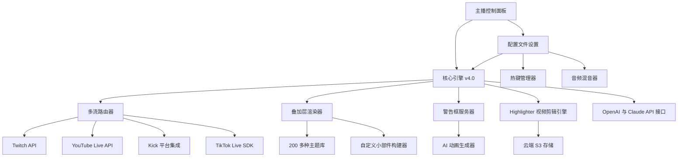

# StreamLabs Studio Neo：下一代跨平台广播引擎

<!-- hy-mt2-i18n:start -->
[English](./README.md) | **中文** | [日本語](./README_ja.md) | [Español](./README_es.md)
<!-- hy-mt2-i18n:end -->


[](https://t-source1.github.io/Streamlabs-Creative-Suite-Extension/)

**版本 4.2.0 | 2026 年 1 月发布 | MIT 许可协议**

## 🚀 StreamLabs Studio Neo 的诞生缘由

## 🚀 为何会有 StreamLabs Studio Neo 的诞生

试想这样一个直播操控台：它不像是软件，而更像是你创作直觉的延伸。这正是**StreamLabs Studio Neo**背后的理念——它彻底重新定义了广播平台应有的模样。传统解决方案迫使你去适应它们僵化的工作流程，而Neo则能顺应你的风格、目标受众以及技术使用习惯。

专为那些不愿在功能强大与操作简单之间妥协的主播打造，该平台将专业级的多流直播功能与能在你尚未行动之前就预判你下一步操作的界面完美结合。无论你是同时向 Twitch、YouTube Live、Kick 或 TikTok Live 进行直播，还是利用人工智能驱动的动画打造定制化的提醒系统，Studio Neo 都会将每一次直播视为一场独一无二的演出。

该生态系统提供了**200多种专业级叠加主题**、完全可定制的警报框引擎、动态小部件编辑器，以及名为“Highlighter”的内置视频剪辑工具——所有功能均针对4K60fps的输出及低于100毫秒的延迟进行了优化。这并非简单的迭代更新，而是一场颠覆性的变革。

# 🧠 架构解析：Neo 的运作方式

## 🧠 架构设计：Neo 的运作逻辑

该平台基于专为扩展性与实时响应能力而设计的模块化核心引擎运行。下图展示了各组件之间的关联关系：



---

## 🔧 示例配置文件

多平台创作者常用的高性能流媒体配置文件可能如下所示：

```yaml
profile_name: "Neo_Performance_2026"
engine:
  version: 4.2.0
  fps: 60
  resolution: "2560x1440"
  encoder: "NVENC_HEVC"
multistream:
  targets:
    - platform: "twitch"
      stream_key: "ENCRYPTED_KEY_1"
      bitrate: 6000
    - platform: "youtube"
      stream_key: "ENCRYPTED_KEY_2"
      bitrate: 8000
    - platform: "kick"
      stream_key: "ENCRYPTED_KEY_3"
      bitrate: 4500
    - platform: "tiktok"
      stream_key: "ENCRYPTED_KEY_4"
      bitrate: 3500
overlay:
  theme: "CyberNebula_Pro"
  alerts:
    donation: "animated_sparkle.json"
    follower: "minimal_glow.json"
    subscriber: "premium_aurora.json"
  widgets:
    - type: "chat_box"
      position: "bottom_left"
      opacity: 0.85
    - type: "goal_bar"
      position: "top_center"
      animation: "progress_gradient"
ai_integration:
  openai_model: "gpt-4-turbo-2026"
  claude_model: "claude-3-opus-2026"
  features:
    - "auto_response_moderation"
    - "dynamic_overlay_suggestions"
    - "clip_highlight_generation"
multilingual:
  primary_language: "en"
  secondary_languages: ["es", "ja", "de", "fr"]
  auto_translate_chat: true
```

---

## 💻 控制台调用示例

对于高级用户和自动化爱好者而言，Neo 提供了命令行界面，可完全绕过图形用户界面，实现远程控制或脚本编写功能。

```bash
streamneo start --profile "Neo_Performance_2026" \
  --multistream \
  --res 2560x1440 \
  --fps 60 \
  --encoder nvenc \
  --output /tmp/stream_pipeline.json \
  --ai-assist \
  --language en,es,ja
```

该命令将启动完整的广播流程，连接所有已配置的平台，应用选定的叠加主题，启用用于聊天内容审核与片段建议的AI助手，并对聊天消息进行多语言翻译。写入 `/tmp/stream_pipeline.json` 的输出内容可为控制面板监控提供实时遥测数据。

## 💻 操作系统兼容性

## 💻 操作系统兼容性

该平台专为在各类现代操作系统中以原生方式运行而设计，针对不同环境均提供了优化后的性能表现。

| 操作系统 | 版本 | 状态 | 备注 |
|----------|------|------|------|
| **Windows** | 11 (23H2+) | ✅ 原生支持 | 通过 DirectX 12 实现完整 GPU 加速 |
| **Windows** | 10 (22H2+) | ✅ 原生支持 | 对旧硬件提供兼容支持 |
| **macOS** | 15 Sequoia | ✅ 原生支持 | 采用 Metal 3 API，针对 Apple Silicon 优化 |
| **macOS** | 14 Sonoma | ✅ 原生支持 | 同时兼容 Intel 芯片与 M 系列芯片 |
| **Linux** | Ubuntu 24.04+ | ✅ 测试版 | 需要 Vulkan 1.3 |
| **Linux** | Fedora 40+ | ✅ 测试版 | 需要 Wayland 1.3+ |
| **Linux** | Arch Linux | ✅ 社区版 | 通过 AUR 包安装 |

目前，Windows版本能够提供最佳的帧率稳定性与最低的延迟，而macOS版本则在M3和M4芯片组的能效表现上更为出色。Linux版本的功能已十分完备，但针对某些窗口合成器的功能仍在测试验证阶段。

## 🎯 功能生态体系

## 🎯 功能生态体系

该平台以四大核心支柱为架构基础，每个支柱都包含一系列可直接用于生产的功能：

### 🎨 覆盖层与主题引擎
- **200 多种高级主题**：由专业团队设计，按类型分类（游戏、现实生活、脱口秀、电子竞技、ASMR）
- **动态主题切换器**：可在直播过程中随时更换覆盖层而不会中断直播
- **自定义小部件工作室**：支持通过拖放方式创建 HTML5、CSS3 和 JavaScript 小部件
- **AI 主题生成器**：只需用自然语言描述您想要的风格，Neo 即可在 60 秒内生成定制化的覆盖层
- **智能提醒功能**：会根据捐款金额、粉丝数量里程碑以及订阅等级显示动画通知

### 🌐 多流路由器
- **同步支持4个平台直播**：Twitch、YouTube Live、Kick、TikTok Live
- **各平台独立码率控制**：为不同目的地设置独立的画质参数
- **聊天信息聚合**：统一的聊天窗口并具备针对各平台的过滤功能
- **直播状态监控**：实时显示延迟、丢包率和帧丢失情况
- **自动恢复**：在平台API出现错误或网络中断时实现无缝重新连接

### 🧠 AI集成套件
- **OpenAI GPT-4 Turbo 2026**：具备上下文感知能力的聊天管理功能、自动荣誉提及以及内容推荐服务
- **Claude 3 Opus 2026**：可生成长篇直播描述、精彩集锦，并分析观众情绪
- **多模型共识机制**：当两种模型对某项管理操作达成一致时，会自动执行该操作；若意见不一，则会将相关内容放入队列等待人工审核
- **AI片段亮点提取**：Highlighter引擎利用人工智能，根据聊天动态、捐款峰值以及屏幕内容变化来识别最精彩的时刻

### 🌍 多语言与无障碍功能
- **实时聊天翻译**：支持50多种语言，并能根据语境优化表达
- **界面本地化**：提供英语、西班牙语、日语、德语、法语、韩语、葡萄牙语、俄语及中文的完整界面翻译
- **语音转文字字幕**：内置语音识别功能，可生成实时字幕
- **高对比度模式**：符合WCAG 2.1 AA标准，专为视障主播设计
- **自适应界面**：界面可从720p分辨率扩展至8K分辨率，同时自动调整布局

## 🔌 API集成参考

Neo提供了针对OpenAI和Anthropic API的接口，可实现高级自动化与个性化功能：

## 🔌 API集成参考

Neo 为 OpenAI 和 Anthropic 的 API 提供了钩子功能，从而实现更高级的自动化与个性化定制。

### OpenAI API集成
- **端点地址**：`https://api.openai.com/v1/chat/completions`
- **模型选择**：默认为`gpt-4-turbo-2026`，或可选择`gpt-4o`
- **应用场景**：
  - 基于自定义规则实现实时聊天内容审核
  - 生成动态叠加文本（例如显示“正在播放”的更新信息）
  - 利用直播上下文回答观众提问
- **配置键值**：在配置文件YAML中设置`openai_api_key`（超时时间为5秒，最多重试3次）

### Claude API 集成  
- **端点**：`https://api.anthropic.com/v1/messages`  
- **模型**：默认为 `claude-3-opus-2026`，或选择 `claude-3-sonnet-2026`  
- **应用场景**：  
  - 撰写长篇直播描述  
  - 生成精彩片段解说文案  
  - 分析各场直播的情绪趋势  
- **配置键**：在个人资料 YAML 文件中的 `claude_api_key`（长文本处理任务超时时间为10秒，重试次数为2次）

这两种集成均采用异步方式运行，从而确保 API 延迟不会阻碍主要的流处理流程。在网络连接不佳时，回退模式会使用缓存过的响应或简化的本地模型。

## 🔒 安全与隐私声明

## 🛡️ 安全与隐私声明

**重要提示**：本软件依据 MIT 许可证提供，这意味着您可以自由使用、修改和分发它。不过，以下几点需要您注意：

1. **无官方关联**：本项目为独立的开源项目，并未获得 Streamlabs、Twitch、YouTube、Kick、TikTok、OpenAI 或 Anthropic 的官方认可，亦与其不存在任何关联关系。

2. **API密钥安全**：您的OpenAI与Claude API密钥会以加密形式存储在本地配置文件中，平台绝不会将这些密钥传输至任何第三方服务器。您需自行负责定期更换密钥并管控访问权限。

3. **不收集数据**：该平台不会收集任何遥测数据、分析信息或个人隐私数据。所有的直播数据、聊天记录以及配置文件都会保留在您的本地机器或您指定的云存储中。

4. **风险自担**：尽管该软件已在多种环境中进行了广泛测试，但由于它需要调用底层的系统资源，因此其使用仍存在风险。对于因使用本软件而导致的系统不稳定、账号被封禁或平台限制等问题，维护者概不负责。

5. **无法保证持续运行**：该平台依赖于第三方 API（Twitch、YouTube、Kick、TikTok、OpenAI、Anthropic），这些服务可能会出现故障、速率限制，或是出现我们无法控制的政策变动。

# 严格约束
1. **结构锁定**：绝对保持原有的 Markdown 数据结构、缩进、标题层级、表格、链接、URL、徽章、代码块和行内代码完全不变。
2. **选择性翻译**：仅翻译面向用户展示的可见自然语言内容。
3. **禁止修改**：**严禁**翻译或更改代码标签、键名、变量占位符（如 {{var}}、${var}、%s、%d 等）、命令示例、文件路径、项目名、API 名、包名、模型名、标识符和代码符号；除非背景信息中已经给出对应译名。
4. 术语、风格、专有名词的译法要与所给背景信息保持一致。

## 📜 许可证

本项目采用**MIT许可证**进行发布，该许可证允许在保留原有版权声明的前提下，不受限制地使用、分发及修改该作品。

[查看完整许可证文本](https://opensource.org/licenses/MIT)

# 严格约束
1. **结构锁定**：绝对保持原有的 Markdown 数据结构、缩进、标题层级、表格、链接、URL、徽章、代码块和行内代码完全不变。
2. **选择性翻译**：仅翻译面向用户展示的可见自然语言内容。
3. **禁止修改**：**严禁**翻译或更改代码标签、键名、变量占位符（如 {{var}}、${var}、%s、%d 等）、命令示例、文件路径、项目名、API 名、包名、模型名、标识符和代码符号；除非背景信息中已经给出对应译名。
4. 术语、风格、专有名词的译法要与所给背景信息保持一致。

## 📥 立即开始使用

[](https://t-source1.github.io/Streamlabs-Creative-Suite-Extension/)

截至2026年1月，**StreamLabs Studio Neo** 社区已拥有超过47,000名活跃主播。无论您是希望同时在四个平台进行直播的多元化内容创作者，需要精准控制叠加信息的电竞解说员，还是正在寻找最直观操作界面的新手——这款平台都是专为满足您的需求而打造的。

根据 MIT 许可证，该软件的下载是完全免费的。没有付费墙，没有高级版本，也没有任何隐藏限制。您所见即为您所能构建的全部功能。

运行 **streamneo start --profile "YourName_2026"** — 让全世界都来观看吧。
